**SENG 637- Dependability and Reliability of Software Systems***

**Lab. Report \#5 – Software Reliability Assessment**

| Group \#: 15      |   |
|-----------------|---|
| Student Names:  |   |
| Sina Salimian   |   |
| Zahra Safari    |   |
| Alireza Esmaili |   |
| Sahar Hajjar Zadeh |   |
| Mehrnaz Senobari |   |
| Fatemeh Ghaffarpour |   |

# Introduction
This assignment is centered around the analysis of integration test data, specifically utilizing specialized tools aimed at assessing reliability. Our exploration will be conducted through two primary methods for evaluating failure data derived from these tests. Each method not only serves as a different approach to reliability assessment but also employs distinct tools designed for this purpose.

The first method we will explore is Reliability Growth Testing. This approach focuses on understanding how the reliability of a system evolves over time as it undergoes testing and subsequent improvements. For this method, we will use the software tool C-SFRAT. C-SFRAT is designed to help analyze and predict the reliability growth of a system based on test data, providing insights into how changes in the system design or implementation affect its reliability.

The second method involves Reliability Assessment through RDC. RDC is a graphical tool that helps in demonstrating the reliability of a system based on test results against predefined reliability targets. This method is particularly useful for verifying if a system meets the reliability requirements stipulated by stakeholders or regulatory bodies. By applying the RDC method, we can visually assess whether the tested system achieves the desired reliability levels, thereby providing a clear and effective means of communicating reliability performance to stakeholders.

Throughout this assignment, we will apply these methods to specific integration test data. By using C-SFRAT for Reliability Growth Testing and RDC for direct reliability demonstration, we aim to gain a comprehensive understanding of the reliability of the system being tested.
# 

# Assessment Using Reliability Growth Testing 
When using the C-SFRAT tool to analyze failure data, two key graphs are typically produced: the MVF graph and the Intensity graph. Each offers unique insights into system reliability during testing.

The MVF graph shows the expected cumulative number of failures over time, providing a visual representation of how reliability improves as issues are identified and corrected.
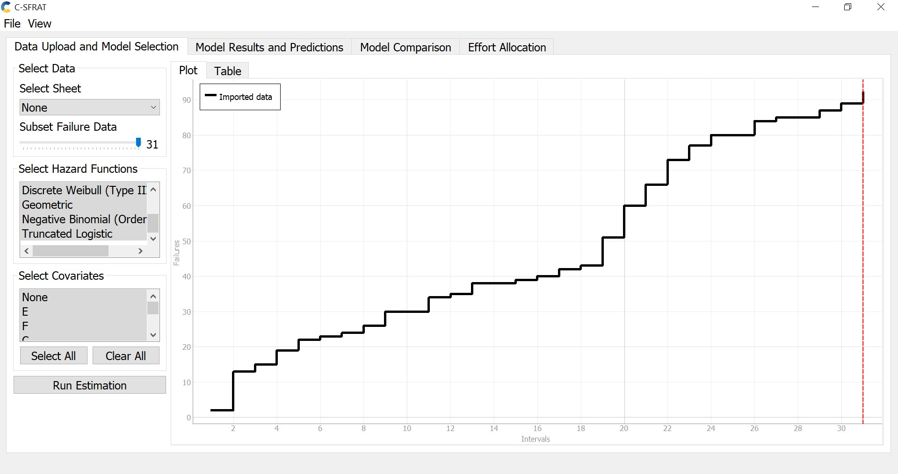

The Intensity graph depicts the rate of new failures over time, helping to assess the immediate state of system reliability. A decreasing trend in this graph suggests improvements in reliability due to effective issue resolution, whereas a plateau or increase could indicate ongoing or new issues.

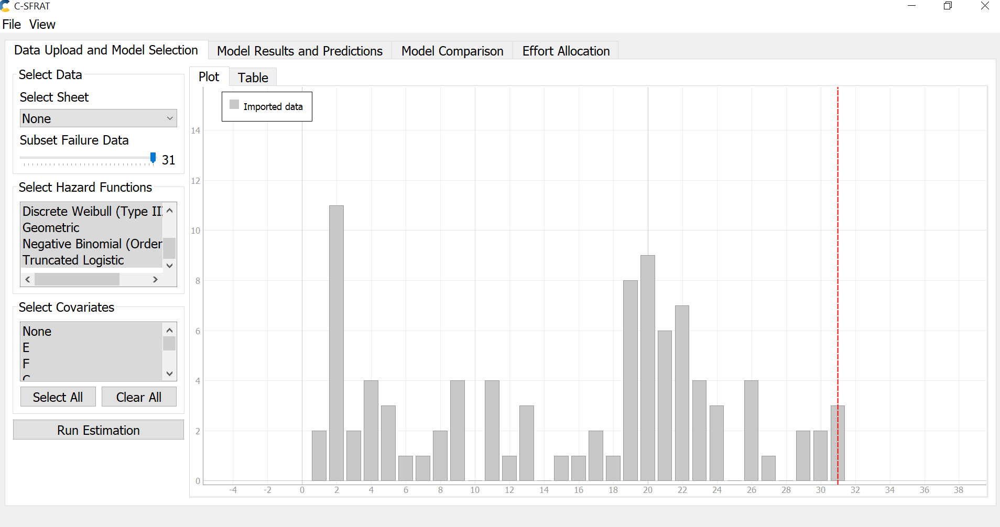

Next, we select all available models, execute the estimations for each, and compare their outcomes based on their log-likelihood values. 

The log-likelihood measures how likely it is that a given model could have produced the observed data. Higher values (less negative) suggest a better fit. By comparing the log-likelihoods, we can objectively determine which models best explain the data. This approach allows for a straightforward comparison between different models, helping to choose the simplest yet effective model under the principle of parsimony.

As illustrated below, the two top-performing models are DW3 (covariates: F) and IFRGSB (covariates: E, F), which exhibit the highest log-likelihoods compared to the others.
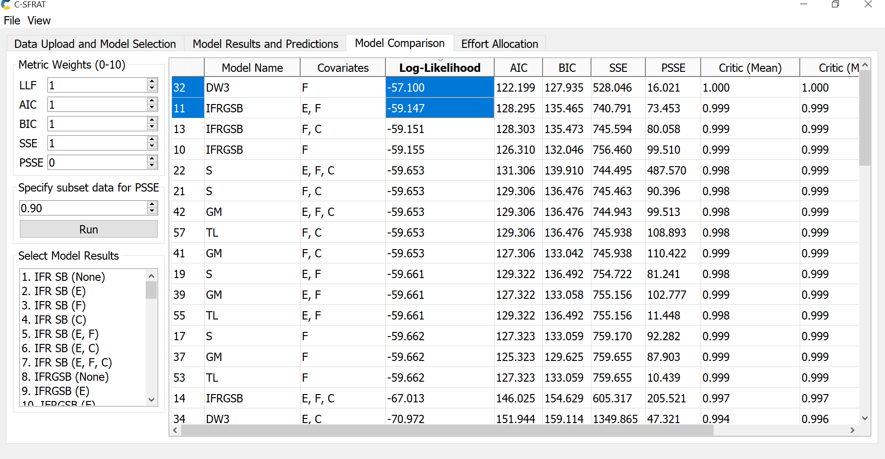

Additionally, the model with the poorest performance (the lowest log-likelihood) is IFR SB (no covariates).
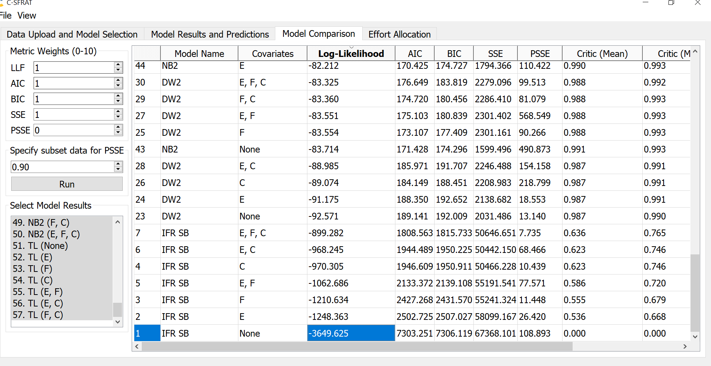

To gain a clearer insight into the functioning of our models, we select each one and display their results collectively on a single graph.
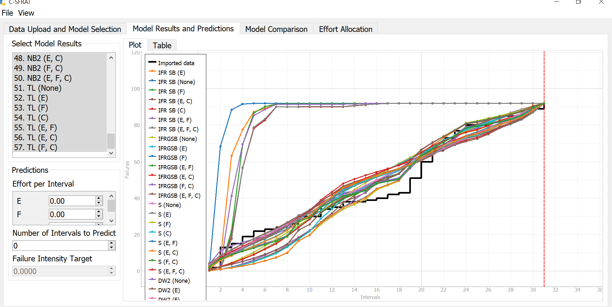

Next, we show the best two models (DW3 and IFRGSB) along with the lowest-performing model (IFR SB). In this way, we would have a better observation of each model's performance
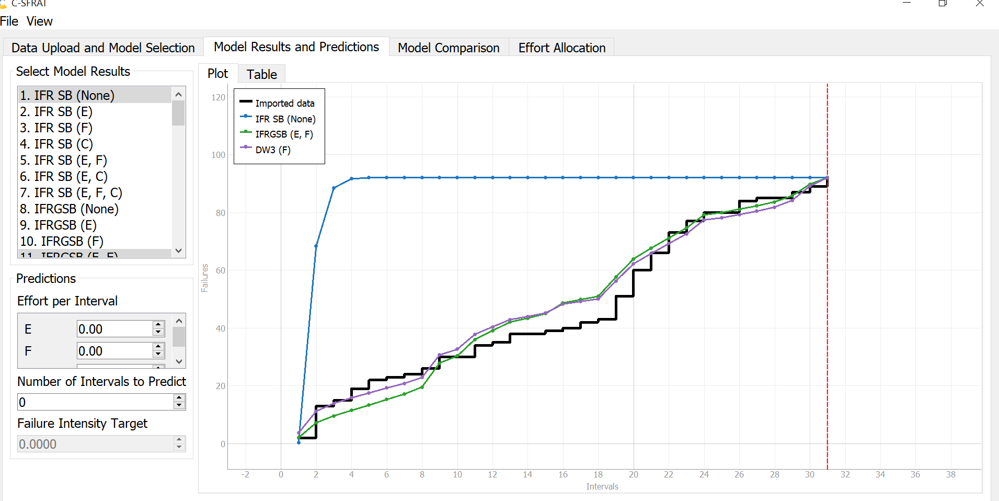

Here is the intensity graph showcasing the top two models.
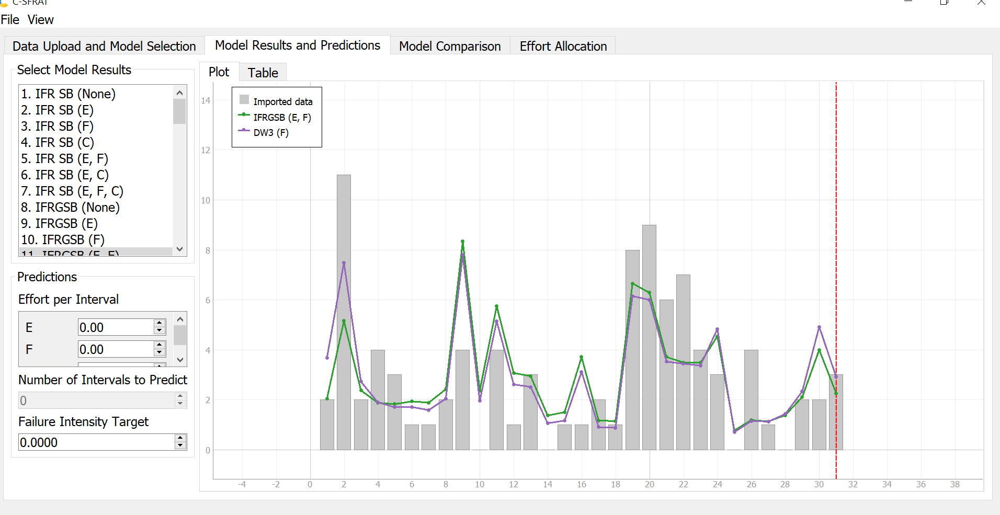

Next is the MVF graph displaying  the top two models.
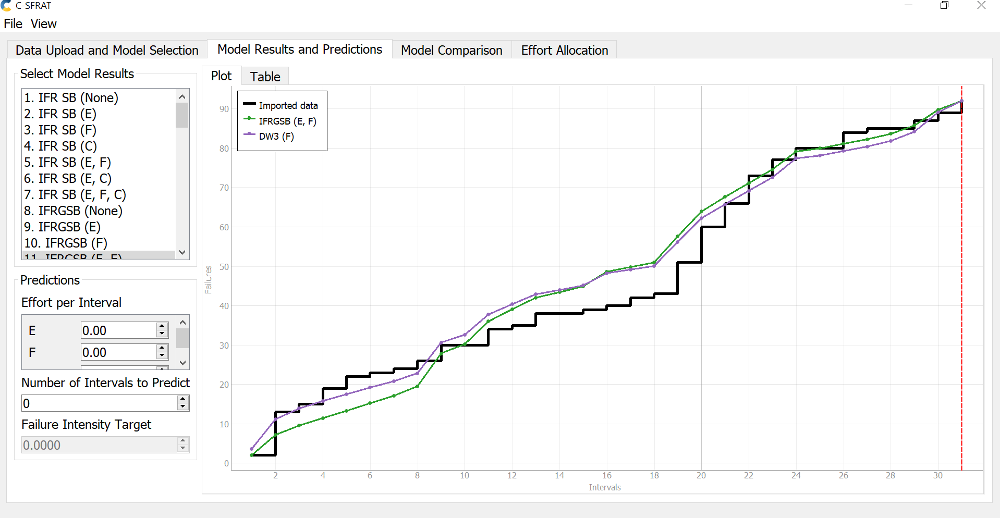

### Result of Range Analysis
#### Reliability

While testing often yields a vast amount of data, not all of it is pertinent. Conducting range analysis allows us to focus only on the failure data that is relevant to our study.

One method to determine the appropriate data range for analysis is the Laplace test. This test compares the observed failure data with the expected failure data derived from a specific model. By doing so, it identifies data points that fall outside the expected range and should therefore be excluded.

However, the C-SFRAT tool lacks the capability to perform range analysis using the Laplace test or similar methods. As a workaround, we have used Python to simulate Laplace analysis, employing the formula provided in our notes. Below is the plot for Laplace analysis.
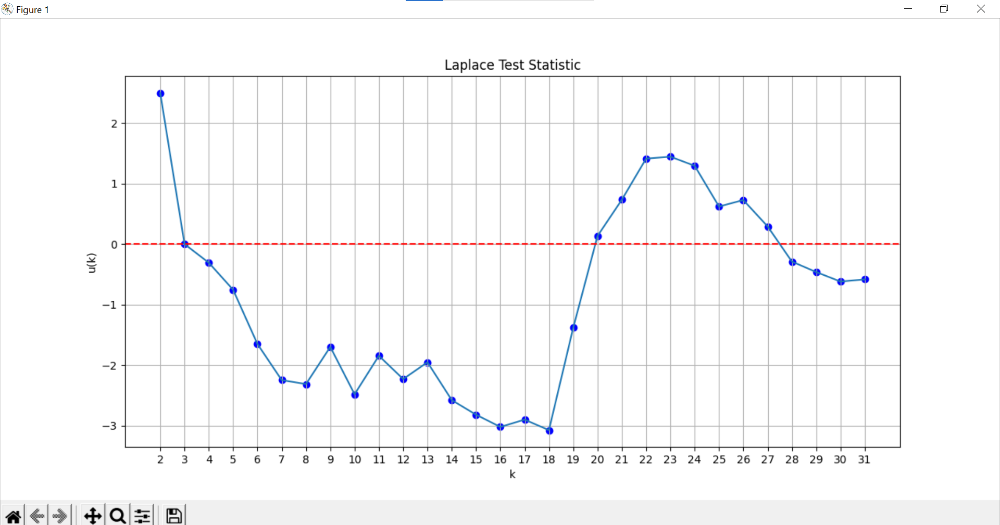

After analyzing the plotted results, we observed improvements in reliability between intervals 3-18 and 27-31. Typically, a Laplace factor ranging from -2 to 2 suggests stable reliability, indicating that our data achieves stable reliability starting from the 19th interval onward. Additionally, negative Laplace factor values signify a decline in failure intensity, while positive values indicate an increase. Our data shows negative Laplace values between intervals 3-20 and 28-31. Consequently, a suitable range containing a sufficient number of data points for analysis would be from interval 1 to 20.

#### Failure rate
Next, we present the plot for the failure rate from intervals 2 to 31. We excluded the first interval because the results significantly differed from the subsequent intervals, which could skew the overall assessment of the failure rate.
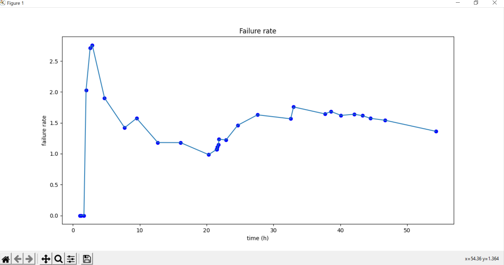
The failure rate plot provides crucial insights into the system's operational reliability over time. From the data visualized, it is evident that after an initial period of fluctuation, the failure rate stabilizes and becomes consistent and predictable. 

### Prediction
Regarding our prediction, we have established a failure intensity rate of 1.3 based on the plot above. As indicated, this rate is expected to be reached within a single interval.
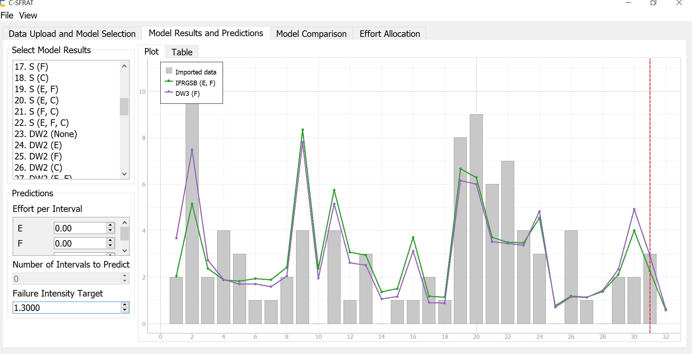

## Advantages and Disadvantages of Reliability Growth Analysis
- ## Advantages
  - Identifies and corrects failures early, enhancing product reliability.
  - Provides data-driven insights for resource allocation.
  - It is suitable with complex systems or products.
  - Predicts when reliability goals will be achieved to better plan production.

- ## Disadvantages
  - Consumes significant time and data, which can delay projects.
  - Reliability of analysis is tied to the accuracy and completeness of data.
  - Requires specialized knowledge and can be challenging to implement.
  - Can lead to unrealistic expectations if not all variables are accounted for.

# Assessment Using Reliability Demonstration Chart

## Three plots for MTTFmin, twice, and half of it 

### 1. Plot with MTTF_min = 6

The failure rate is set at 6 failures per 1,000,000 calls.
Most of the observed failures are plotted within the ‘Accept’ region, indicating a high level of system reliability. This suggests that the system's performance is meeting or exceeding the reliability target set for the given operational context.
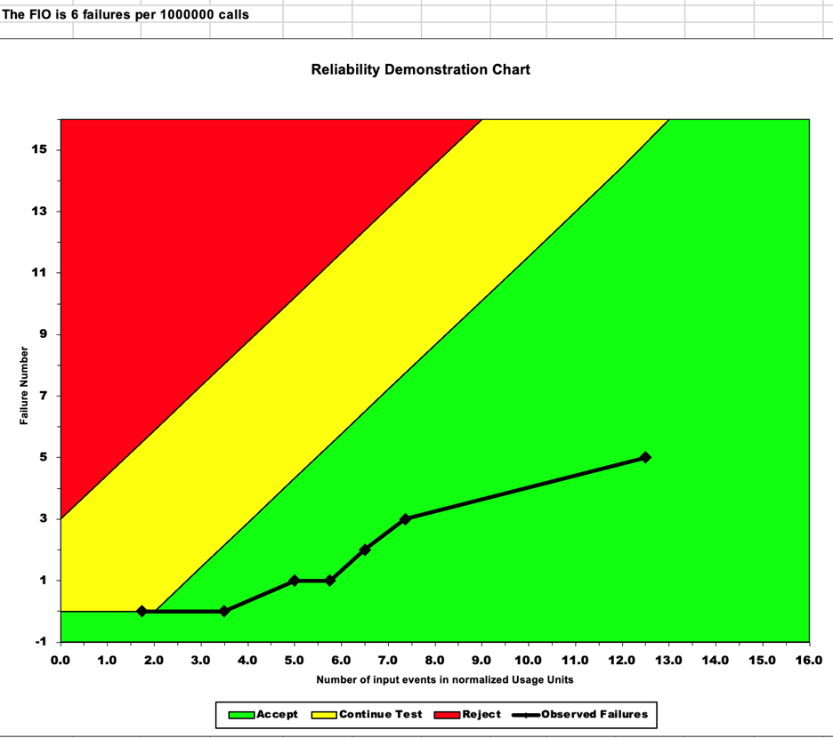

### 2. Plot with MTTF_min Double = 12

The failure rate is set at 12 failures per 1,000,000 calls.
All the observed failure points within the 'Accept' region. This indicates that the system is performing reliably against the set criteria and that the failures are within acceptable limits.
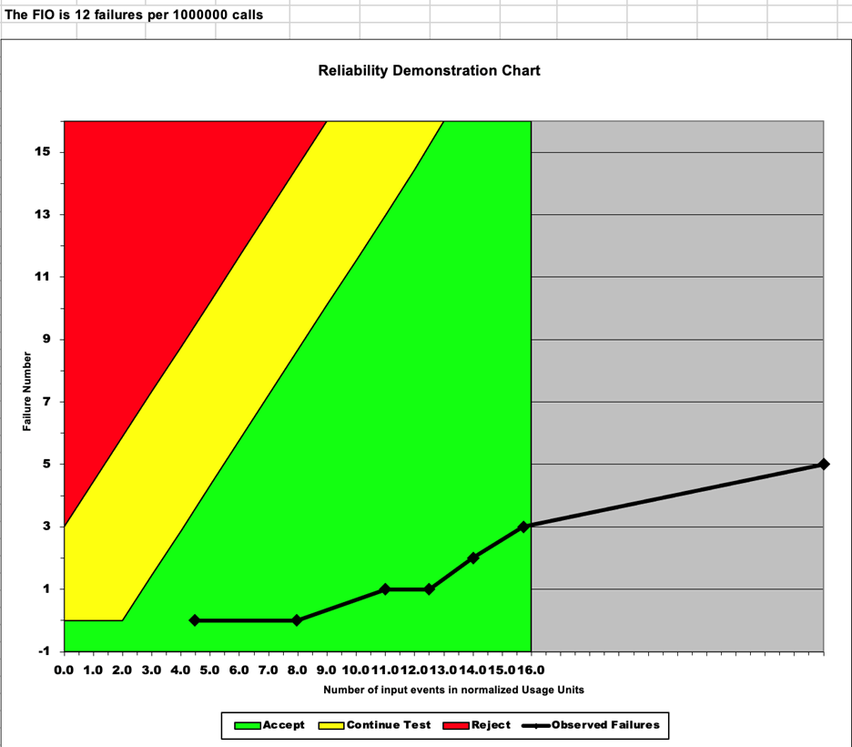

### 3. Plot with MTTF_min Half = 3
The failure rate is set at 3 failures per 1,000,000 calls.
The observed failures trend into the 'Continue Testing' region. This demonstrates that while the system may have a decent level of reliability, the confidence in meeting the reliability target is lower. It suggests that additional testing is required to determine if the reliability target can be confidently met.
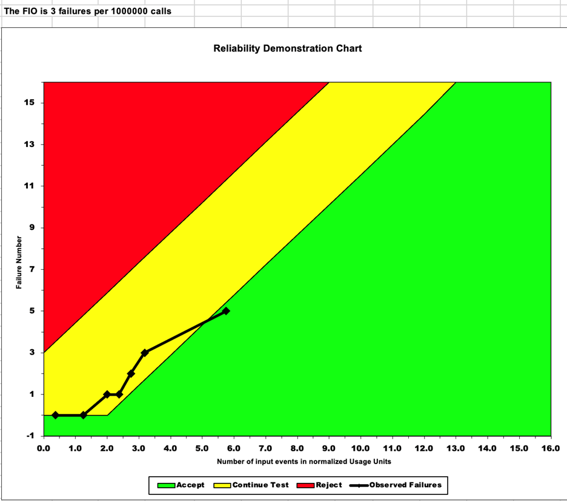

## Explain your evaluation and justification of how you decide the MTTFmin
The MTTF for our system was calculated using the time-tested formula:
MTTF = Total operational time / Total number of failures
Our goal was to identify the MTTF_min that situates most failure data within the 'Accept' zone of the Reliability Demonstration Chart (RDC). This indicates a reliable system. Using a series of trial and error with the failure data, and keeping the risk parameters at default levels (γ = 2.000, α = β = 0.100), we aimed to have the data mostly in the 'Accept' or at least the 'Continue Testing' regions. Through our iterative method, trying whole numbers divisible by 2, we established that MTTF_min of 6 provides an appropriate balance. It avoids underestimating the failure rate while acknowledging the need for possible further testing. It represents a realistic assessment of our system's reliability. This places the data on the edge of the 'Accept' and 'Continue Test' regions, suggesting a reliable system but also factoring in the potential for performance variability. 

## A discussion on the advantages and disadvantages of RDC

The Reliability Demonstration Chart is a powerful tool for visualizing and evaluating the reliability of a system with limited failure data. It allows for a clear demarcation of acceptability regions and the incorporation of risk trade-off parameters, providing a visual and statistical basis for decision-making.
**Advantages include:**

- Simple Visual representation of reliability data
- The ability to incorporate different risk profiles for Developers and Users
- Useful for "what-if" scenarios to understand the impact of changes in MTTF on system reliability

**Disadvantages might include:**

- Dependence on accurate and representative failure data
- The requirement for a clear understanding of operational conditions to set realistic MTTF_min values

# Comparison of Results

Both C-SFRAT and RDC rely on failure data to evaluate system reliability, highlighting trends and offering visual insights over time. C-SFRAT is more analytical, using statistical models to predict reliability growth, while RDC provides a straightforward graphical evaluation against a set MTTF target. C-SFRAT's approach is probabilistic, with tests like Laplace determining data relevance, whereas RDC offers a quick, deterministic assessment. The choice between them depends on the specific needs of the reliability assessment—C-SFRAT for in-depth analysis and RDC for immediate visual evaluation. Together, they form a comprehensive toolset for assessing and planning system reliability.

# Discussion on Similarity and Differences of the Two Techniques
Here's a discussion on the similarities and differences between Reliability Growth Testing (RGT) using C-SFRAT and Reliability Demonstration Chart (RDC) assessment.

## Similarities

- Both techniques use failure data to assess system reliability.
- Both can identify trends in the data to make informed decisions about the system's reliability.
- Each provides a graphical representation of reliability over time.

## Differences

- C-SFRAT uses statistical models to predict failure behavior and growth in system reliability, while RDC uses a fixed graphical approach to evaluate against a target MTTF.
- C-SFRAT allows for model fitting and selection, providing a probabilistic understanding of reliability growth, whereas RDC is more deterministic, based on set failure thresholds.
- The Laplace test in C-SFRAT can be used to determine data relevancy, which is not a feature of RDC.
- RDC is simpler and can quickly indicate whether a system's reliability meets the target based on MTTF, whereas C-SFRAT provides a deeper analysis with predictions of future reliability.

## Lessons Learned

- The selection of a proper model in reliability growth testing is critical for accurate predictions.
- Visualization tools like RDC are useful for quickly assessing reliability against targets, but they must be supported by in-depth analysis like that offered by tools such as C-SFRAT.
- Data range analysis, such as Laplace tests, can significantly affect the interpretation of the reliability results and should be considered in any reliability assessment procedure.
- Both RGT and RDC have their own set of advantages and should be chosen based on the context of the assessment, the amount and quality of available data, and the specific requirements of the reliability evaluation.

In conclusion, while both C-SFRAT and RDC have their distinct methodologies and applications, they complement each other in providing a comprehensive reliability assessment. C-SFRAT gives a detailed analysis suitable for planning and improving system reliability over time, while RDC offers an immediate visual assessment against predefined criteria. The combination of both provides a robust framework for reliability assessment in engineering systems.

# How the team work/effort was divided and managed

Our team divided the workload for the project into two subgroups, with each handling a different aspect of the reliability assessment: one focused on reliability growth testing and the other on the reliability demonstration chart. Recognizing the technical limitations some team members faced with the software, we paired individuals accordingly to ensure everyone could contribute effectively. Each subgroup conducted their tests independently, then came together to examine and discuss their findings, allowing us to draw comparisons between the two methodologies. After completing the assessments, each subgroup briefed the other on their results, facilitating a comprehensive understanding across the entire team. This cooperative review ensured that every team member grasped the key concepts of both reliability assessment techniques.

# Difficulties encountered, challenges overcome, and lessons learned

In this lab, we faced and overcame several challenges. Compatibility issues with Mac OS initially slow down our workflow, but we adapted by exploring various models and options. We had limited guidance on how to input data, modify tool settings, and interpret the software's results. But we learned interpret the reliability graphs and data for the system. We also navigated the complexities of the RDC Excel file, determining which parameters could be adjusted through trial-and-error to find the correct MTTF values.
These obstacles taught us persistence, teamwork, and how to tackle problems effectively. We learned the value of patience, resourcefulness, and the careful application of new methodologies, enhancing our grasp of software reliability assessment.

# Comments/feedback on the lab itself

The lab presented a valuable hands-on experience; however, a more comprehensive tutorial or guide would be beneficial to navigate the software and its features more effectively. This could enhance the learning experience by providing clearer direction on data input, parameter adjustments, and result interpretation, allowing for a more efficient and educational lab session.
